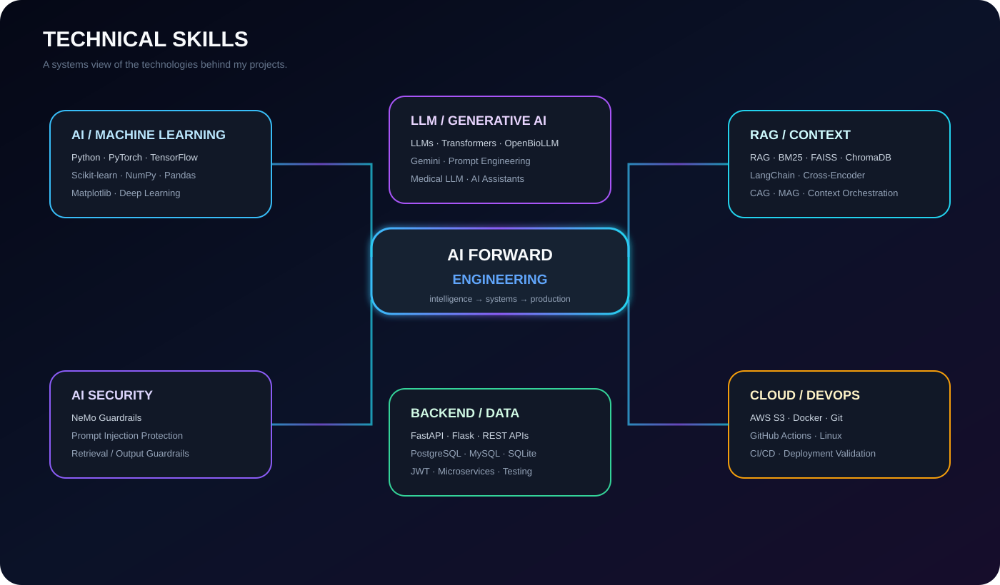
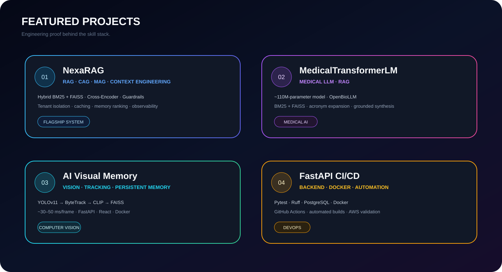

<div align="center">



<br/>

<a href="https://github.com/Livesh-L-28"></a>
<a href="https://www.linkedin.com/in/livesh-l-aa9821322/"></a>
<a href="mailto:liveshjaidj@gmail.com"></a>

</div>

## `01` — ABOUT

I'm an **Artificial Intelligence & Data Science** student focused on **AI Forward Engineering** — building production-oriented intelligent systems across **LLMs, RAG, context engineering, AI security, Machine Learning, Computer Vision, backend systems and cloud**.

> **Build → Measure → Secure → Ship**

---

## `02` — TECHNICAL SKILLS

<div align="center">

</div>

### AI / Machine Learning
`Python` · `PyTorch` · `TensorFlow` · `Scikit-learn` · `NumPy` · `Pandas` · `Matplotlib` · `Deep Learning`

### LLM / Generative AI
`LLMs` · `Transformers` · `OpenBioLLM` · `Gemini` · `Prompt Engineering` · `Medical LLM`

### RAG / Context Engineering
`RAG` · `BM25` · `FAISS` · `ChromaDB` · `LangChain` · `Cross-Encoder` · `CAG` · `MAG` · `Context Orchestration`

### AI Security
`NVIDIA NeMo Guardrails` · `Prompt Injection Protection` · `Retrieval Guardrails` · `Output Guardrails` · `Tenant Isolation`

### Computer Vision
`OpenCV` · `YOLOv11` · `ByteTrack` · `CLIP`

### Backend / APIs
`FastAPI` · `Flask` · `REST APIs` · `JWT` · `Microservices` · `Unit Testing`

### Frontend
`React` · `TypeScript` · `Tailwind CSS` · `D3.js`

### Databases
`PostgreSQL` · `MySQL` · `SQLite`

### Cloud / DevOps
`AWS S3` · `Docker` · `GitHub Actions` · `Git` · `Linux` · `CI/CD`

### Languages
`Python` · `Java` · `C#` · `JavaScript` · `TypeScript` · `SQL`

---

## `03` — FEATURED PROJECTS

<div align="center">

</div>

### `01` NexaRAG

**Advanced RAG + CAG + MAG + Context Orchestration Platform**

Hybrid BM25 + FAISS retrieval, cross-encoder reranking, deterministic context priority fusion, namespaced caching, memory ranking, tenant-isolated PostgreSQL, NVIDIA NeMo Guardrails and Prometheus-compatible observability.

[**Repository →**](https://github.com/Livesh-L-28/Nexa_RAG)

### `02` MedicalTransformerLM

**Domain-Specific Medical LLM + RAG**

A ~110M-parameter MedicalTransformerLM with OpenBioLLM, hybrid retrieval, medical acronym expansion and grounded synthesis.

[**Repository →**](https://github.com/Livesh-L-28/MEDICAL_LLM)

### `03` AI Visual Memory

**Persistent Visual Memory System**

`YOLOv11 → ByteTrack → CLIP → FAISS`, with approximately 30–50 ms/frame latency.

[**Repository →**](https://github.com/Livesh-L-28/AI-Visual-Memory-System)

### `04` FastAPI CI/CD

**Containerized Backend Delivery Pipeline**

FastAPI + Pytest + Ruff + PostgreSQL + Docker + GitHub Actions with AWS deployment validation.

[**Repository →**](https://github.com/Livesh-L-28/fastapi-cicd-lab)

### `05` UniGuide AI

**RAG-Based University Assistant**

50+ documents, 1,000+ vector chunks and 92–96% query accuracy.

[**Repository →**](https://github.com/Livesh-L-28/RAG_DOCUMENT)

### `06` Leviathan

**AI Sustainability & Anti-Greenwashing Platform**

Scikit-learn ensemble + TF-IDF + Gemini reasoning with reported `R² = 0.88`.

---

## `04` — ENGINEERING METRICS

<div align="center">

| `~110M` | `92–96%` | `30–50 ms` | `0.88` |
|:---:|:---:|:---:|:---:|
| Medical LLM parameters | UniGuide query accuracy | Visual latency/frame | Leviathan R² |

</div>

---

## `05` — EXPERIENCE

### AI Intern · Chargebee
`Feb 2026 – Aug 2026`

Built **Leviathan**, an AI-powered sustainability and anti-greenwashing audit platform using ensemble ML, TF-IDF + Gemini reasoning and product-data APIs.

### XR Developer · XARC
`May 2026 – Aug 2026`

Engineered the XARC Nexus Aggregator Desktop Client using React, TypeScript, Electron, Unity Addressables and AWS S3.

### Machine Learning Intern · Femtosoft Technologies
`Jul 2025 – Aug 2025`

Worked across data collection, preprocessing, EDA, feature engineering, training and evaluation.

### Power BI Intern · Cognifyz Technologies
`Sep 2024 – Oct 2024`

Built dashboards, Power Query transformations, DAX measures and KPI reporting.

---

## `06` — EDUCATION

**B.Tech — Artificial Intelligence & Data Science**  
Prathyusha Engineering College · Tamil Nadu

`2023 – 2027` · **CGPA 8.53 / 10**

---

## `07` — ENGINEERING PRINCIPLES

```text
01  Build systems, not isolated models.
02  Ground AI outputs with reliable retrieval.
03  Treat AI security as an architectural layer.
04  Measure before optimizing.
05  Automate testing and delivery.
06  Design for reproducibility.
07  Keep systems modular and observable.
08  Ship production-oriented engineering.
```

---

<div align="center">

### BUILD · MEASURE · SECURE · SHIP

<a href="mailto:liveshjaidj@gmail.com">Let's connect →</a>

</div>
